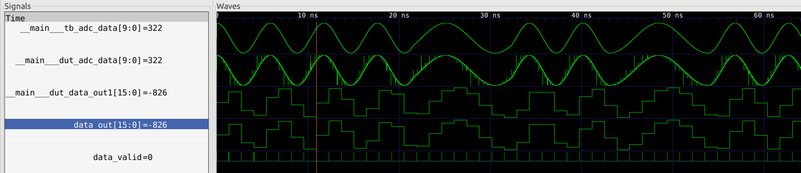

# A LiteX IP for AX.25 packet radio 

Currently a work in progress: so far there is only a module for reading sample
data from an ADC via SPI and a test bench module for emulating the ADC and
Bell 202 AFSK signal generation in simulation. Next step is to implement the RX
side demodulation with DSP. Once the TX modulation is implemented, that can take
the place of over-sized sample array used as the TB signal generator. The
implementation and TB assumes a MCP3001 10 bit ADC is used.
[MCP3001 datasheet PDF](http://ww1.microchip.com/downloads/en/DeviceDoc/21293C.pdf)
The design should be easily ported to other ADCs.

Screen capture of a simulation waveform:

